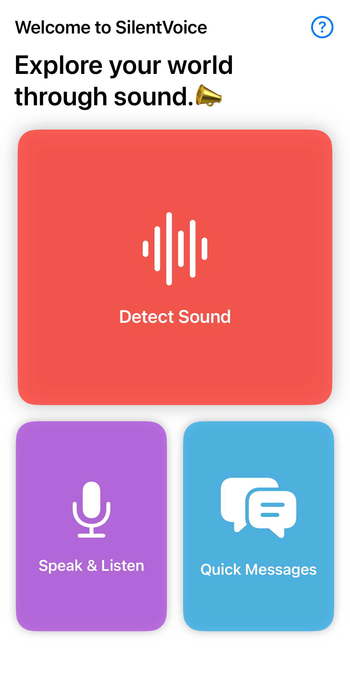
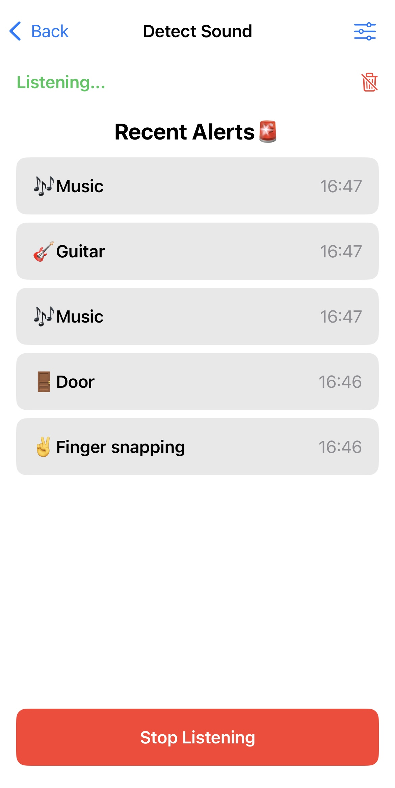
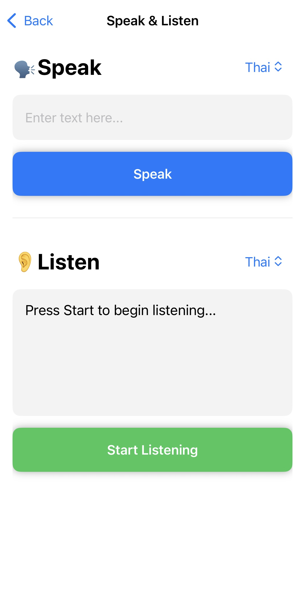

# SilentVoice
SilentVoice is a user-centric iOS accessibility application designed to empower individuals with hearing impairments. By leveraging on-device machine learning (Core ML & AVFoundation), the app detects critical environmental sounds in real-time—such as car horns or name calls—and translates them into discreet, frictionless visual and haptic notifications. Built entirely with SwiftUI, it focuses on inclusive design, privacy, and providing a highly customizable contextual UX.

  
   
  

